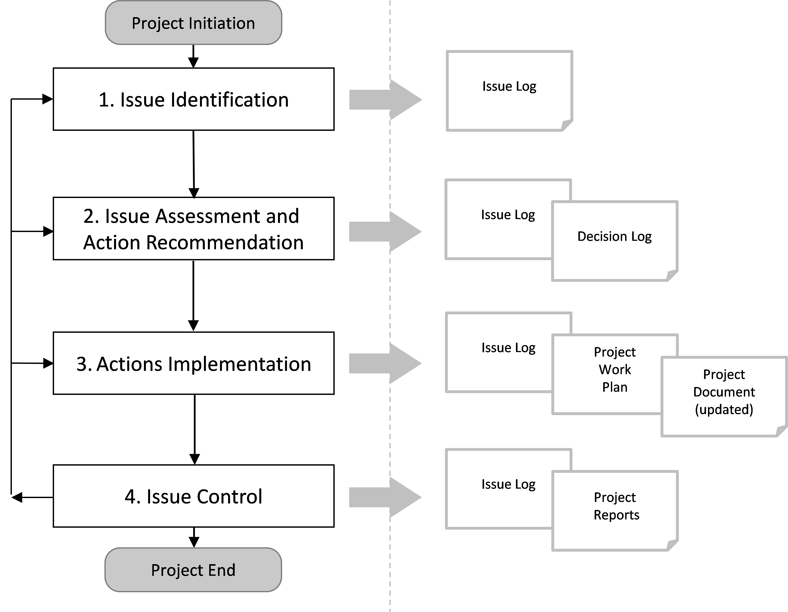

== 3. ISSUE MANAGEMENT PROCESS DESCRIPTION
[aqua]#<Please tailor the issue management process if necessary (complete description or delete activities that are not applicable to the project.>#

The PM2 project issue management process defines the activities related to identifying, documenting, assessing, prioritising, assigning, resolving and controlling issues.
The issue management process for this project is a four-step process and falls under the responsibilities of the Project Manager (PM) who should execute the process when required throughout the project lifecycle:
[discrete]
==== Step 1: Issue Identification
The purpose of this step is to facilitate the identification and documentation of issues. Examples of issues that can arise in the project are:

*	There are disagreements on the interpretation of requirements;
*	The project team has difficulties achieving the set goals (e.g. in terms of time, resources or quality);
*	Non-conformities are identified by the Project Core Team or by other Stakeholders (e.g. Quality Assurance Manager);
*	Risks identified in the Risk Log occur, and thus risks change from potential problems to actual problems;
*	External effects that influence the project in a negative way;
*	Many other reasons.
Issues can be identified / raised by any [red]#Project Stakeholder# throughout the project lifecycle, using different communication channels as meetings, emails, reports, among others.

After receiving the issue information, the Project Manager (PM) registers the issue in the Issue Log. Issues [red]#can be also registered in# the _Issue Log_ [red]#by the Project Core Team Members# and then validated by the Project Manager (PM).

The _Issue Log_ contains information to be fulfilled at this stage, such as the issue identifier, the issue category (e.g. IT, business, People & Organisation, etc.), the issue details and impact, the status of the issue, the name of the person that identified the issue and the date of identification.

[discrete]
==== Step 2: Issue Assessment and Action Recommendation:
The purpose of this step is to assess the urgency and impact of the issue and decide on a priority for its resolution.
When an issue arises, an initial assessment (informal) will be performed by the person who raised the issue. This informal assessment will consider dimensions like:

*	*Category:* Is the issue related to a specific area?
*	*Impact:* What are the possible consequences of this issue? Will it have contractual impacts?
*	*Urgency:* How urgent is a solution to this issue? This will influence the speed and planning of the issue reporting and resolution.
*	*Size:* Is it an issue that requires some effort/cost to solve, or is it best handled by immediate action?

[aqua]#<In the initial assessment is not necessary to go very deep into the considerations of the various dimensions, but the reporting of the problem should be adjusted to the situation and its impact. If the issue has been judged urgent, the Project Manager must be advised, to ensure a prompt handling of the issue.>#

After this first assessment, the Project Manager (PM) [red]#assigns the detailed analysis of the issue to a project +
stakeholder#. This person will assess the issue and [red]#identify its root cause#. Also, it will recommend a solution +
and detail the necessary steps, effort and resources involved. This information will be documented in the _Issue Log_ +
and then used as an input to [red]#request the approval by the appropriate decision makers# (based on the escalation +
process). The Project Manager (PM) then documents the decisions in the _Decision Log_. +
Issues can generate new change requests and therefore the next steps may follow the project change management process.

[discrete]
==== Step 3: Actions Implementation:
After issues are evaluated and the remediation actions approved, the Project Manager (PM) will incorporate these actions into the _Project Work Plan_ and update project related documentation such as project plans and logs (e.g. _Decision Log, Resource Plan, Change Log, and Communications Management Plan_, if applicable).

[discrete]
====  Step 4: Issue Control:
The purpose of this step is to monitor and control the issues identified during the project, to be able to easily communicate them to the several project decision layers, for remediation action approval or status updates.

Project Status meetings will be performed [lime]#weekly# and used to revise the status of issues and related actions, and to identify new issues. The Project Manager (PM) is responsible for updating the _Issue Log_, which can include adding new issues, updating issue status, updating remediation action details, modifying urgency, impact, and/or size levels based on changes in project environment, etc.

Additionally, the Project Manager (PM) will report periodically [lime]#(monthly)# the status of the major issues identified for the project to the Project Steering Committee and, when adequate, to other project stakeholders (as per the project _Communications Management Plan)_.

[.text-center]
.Issue Management Process Diagram.

[aqua]#<If you tailor the process, make sure you recreate the above process diagram>#

=== 3.1. Issue Management Roles and Responsibilities
The main roles and responsibilities for the issue management process are:

*   *Project Steering Committee (PSC):* is consulted for the approval of the remediation actions and monthly informed of the status of issues. It can re-assess issues and modify urgency, impact, or size, identify new issues, refine remediation action approach and escalate issues to other stakeholders.
*   *Project Owner (PO):* is accountable for all the identified issues and has the responsibility of approving or rejecting the remediation actions related to the major issues, or escalated them according to the escalation procedure.
*   *Business Manager (BM):* is consulted for the assessment of issues and to validate the recommended action steps, urgency, impact, size/effort and time estimation. The Business Manager (BM) is also responsible for identifying and evaluating the business related issues and then for communicating these issues to the Project Manager (PM).
*   *Solution Provider (SP):* is [red]#informed# of the issues and of the planned remediation actions for the project. The solution Provider is also consulted for the approval of the recommended action steps, urgency, impact, size/effort and time estimation, from a provider perspective (at the Project Steering Committee).
*   *Project Manager (PM):* is responsible for managing, monitoring, controlling and reporting issues and consolidating and documenting them in the Issue Log. The PM assigns issues remediation tasks to Project Core Team members or to other project stakeholders. The person assigned to the issue will work on it, respective of the given priority and report when the issue can be closed.
*   *Project Core Team (PCT):* is consulted for the issue management activities and identifies, assesses and solves issues throughout the project lifecycle.
*   *Business Implementation Group (BIG):* can identify new issues and is consulted for the assessment of issues and to validate the recommended action steps, urgency, impact, size/effort and time estimation, when appropriate.
*   *Other Stakeholders:* <Please add other stakeholders if relevant.>

The following RASCI table defines the responsibilities of those involved in issue management:
[cols="5,,,,,,,,",options="header"]
|===
|RAM (RASCI)|	*AGB**|	PSC	|PO|	BM|	UR|	SP|	PM|	PCT
|Issue Management Plan |	I|	I|	*A*|	C	|C|	I|	*R*|	C
|Manage Issues & Decisions |	I|	I|	*A*|	S|	C|	I|	*R*|C
|===
*AGB: Appropriate Governance Body. (e.g. for IT projects, this is the IT Steering Committee).

The contact details of each of the above stakeholders are documented in the Project Stakeholder Matrix.
