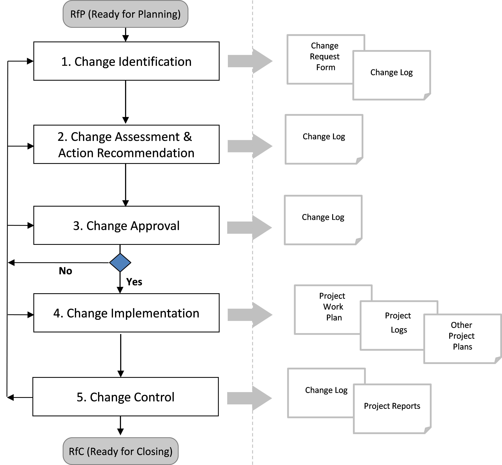

== 3. ISSUE MANAGEMENT PROCESS DESCRIPTION
[aqua]#<Please tailor the change management process if necessary (complete description or delete activities that are not applicable to the project.>#

The PM2 project change management process defines the activities related to identifying, documenting, assessing, approving, prioritising, planning and controlling changes, and communicating them to all relevant stakeholders.

The change management process for this project is a five step process and falls under the responsibilities of the Project Manager who should execute the process when required throughout the project lifecycle:
[discrete]
==== Step 1: Change Identification
The purpose of this step is to facilitate the identification and documentation of change requests to project baselines as scope, requirements, deliverables, resources, costs, schedule or quality characteristics.

Changes can be requested (or identified and raised) throughout the project lifecycle by any Project Stakeholder. After receiving a change request, the Project Manager (PM) registers the requested change in the _Change Log_ and makes sure the change request is described using the _Change Request Form_.

A request for a change can be submitted formally via a _Change Request Form_, or can be identified and raised during meetings as a result of decisions, issues or risks. The _Change Log_ contains information to be fulfilled at this stage, such as the change identifier, the name of the requestor, the date of identification, the change category (e.g. new requirement, issue or risk related, business, etc.), the change details and impact, and the status of the change.

[discrete]
==== Step 2: Change Assessment and Action Recommendation
The purpose of this step is to assess a) whether this request is indeed a) a project change, b) define the different options to meet this request, c) assess the size of the identified change for each option defined in terms of the impact to the project objectives, quality, risk, schedule, cost, effort, and the contract with the contractor, and d) decide on a priority for the implementation of that change request.

After this assessment, the recommended action will be detailed with the necessary steps, deliverables, cost, timescale and resources involved. Be aware that the recommended action may be to reject the requested change. This information will be documented by the Project Manager in the _Change Log_ (the _Change Request Form_ documents the original request) which is then used as an input to the formal change approval or rejection by the appropriate decision makers.

New changes can generate new risks, issues or quality requirements and therefore change assessment will include the assessment of current or new risks, issues and quality requirements. The design of the change implementation (action) will also impact cost, scheduling and resources assigned to the project, so all these dimensions will be assessed before change approval. If a contractor is involved, the impact on the contract needs to be considered. Any change
to a contract brings a considerable amount of administrative work that is costly and may delay the project. Be aware that the amount of change to a contract may be constraint by the European tendering rules.

[discrete]
==== Step 3: Change Approval
The purpose of this step is to achieve a decision regarding the approval or rejection of the change, according to the escalation procedure defined for the project (i.e. reviewed by the appropriate decision makers within the
Managing/Directing/Steering layers - see the PM2 Governance Model). Changes classified with high size will always be communicated to the Directing or Project Steering Layer. Moreover, project scope changes will be yearly reported to the
Corporate Governance Bodies.

There are four possible decisions to be considered: Approve, Reject, Postpone, or Merge the change request.
The decision details are documented in the _Change Log_. Key decisions may also be logged in the _Decision log_. If the change request needs further information or clarification, it returns to the "Change Assessment and Action Recommendation" step.

[discrete]
==== Step 4: Change Implementation
For the approved or merged changes, the Project Manager will incorporate the actions related to these changes into the Project Work Plan and update project related documentation such as project plans, logs and checklists, (e.g._Requirements Documentation, Quality Management Plan, Resource Plan, Deliverables Acceptance Management Plan, Risk Log, Issue Log, Decision Log, Quality Review Checklist and Deliverables Acceptance Checklist_, if applicable).

[discrete]
==== Step 5: Change Control
The purpose of this step is to monitor and control project changes, to be able to easily communicate them to the several project decision layers, for approval or status updates. The Project Manager will collect any changes to the project or related actions and control the status of each change management activity.

Project Status meetings will be used to revise the status of changes and related actions, and to identify new changes. The Project Manager is responsible for updating the _Change Log_, which can include adding new changes, updating change status, updating effort estimation, modifying size and/or priority levels based on changes in project environment, etc.

Additionally, the Project Manager will report periodically (monthly) the status of project changes to the Project Steering Committee (PSC) and, when adequate, to other project stakeholders (as per the _Communications Management Plan_),+
e.g. to the Corporate Governance Bodies (yearly _Project Progress Report_).

[.text-center]
.*Fig 1* Change_Management_Process.

[AQUA]#<If you tailor the process, make sure you recreate the above process diagram>#