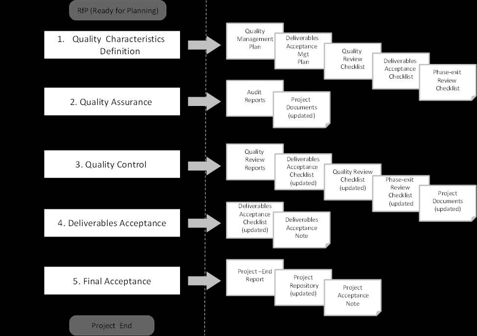

== 3. QUALITY MANAGEMENT PROCESS
[aqua]#<Please tailor the quality management process if necessary (complete description or delete activities that are not applicable to the project.>#

The project quality management process comprises all activities (related both to processes and deliverables) that will increase the ability to meet the project expected results identified in the Project Charter.

The quality management process for this project is comprised of five key steps:

*	Define (Project) Quality Characteristics;
*   Perform Quality Assurance;
*	Perform Quality Control;
*	Perform Deliverables Acceptance; and
*	Perform Final (Project) Acceptance.

[discrete]
==== Step 1: Define Quality Characteristics
The purpose of this step is to identify the objectives, approach, requirements, activities and responsibilities of the project's quality management process and how it will be implemented throughout the project. These are documented in this plan based on the project objectives, approach, deliverables, expected benefits and resources available (as defined in the Business Case, Project Charter, Project Handbook, Project Work Plan, and other relevant plans).

The Quality Management Plan includes the description of the:

*	Quality objectives, approach and requirements;
*	Quality standards, guidelines, tools and techniques, e.g. the Quality Review Checklist and the Deliverables Acceptance Checklist;
*	Quality assurance activities and related responsibilities, e.g. Project Review Meetings, monthly activities report, compliance verification and audits to contractors' quality assurance activities, among others;
*	Quality control activities for continuous improvement, e.g. project management artefacts review and quality plans reviews;
*	Configuration procedure related to project artefacts and deliverables.

Any quality activities related to project management artefacts are documented in the Quality Management Plan, while quality assurance and control activities related to project deliverables can be found in separate documents as e.g. test plans. These documents are project domain specific and therefore not part of the PM² . Quality Control activities in the context of formal customer acceptance of the deliverables are documented in the Deliverables Acceptance Plan.

[aqua]#<In the case where no formal Deliverables Acceptance Plan exists, then the Deliverables Acceptance activities can be described in the Quality Management Plan (or in the Project Handbook)>#

The techniques that will be used for quality planning are the following ones:

* [lime]#Cost-benefit analysis;#
* [lime]#Cost of Quality (CoQ);#
* [lime]#Benchmarking;#
* [lime]#Statistical sampling;#
* [lime]#Quality Requirements Prioritisation (MoSCoW – Must have, Should have, Could have, or Won't have).#
* [lime]#…#

[aqua]#<Please customise the above list as per your project or/and organization needs.>#

Considering requestor requirements, the Project Manager (PM) determines the balance between cost/time/risk and quality of deliverables based on a cost-benefit analysis and defines the quality assurance and control activities. For these activities, quality metrics should also be defined along with acceptance tolerances.

The Quality Review Checklist, the Phase-exit Review Checklist and the Deliverables Acceptance Checklist are the tools that will be used to validate compliance with this plan. The above checklists should be defined and created during the planning phase [aqua]#<Customise the PM2 templates>.#

[lime]#Additionally, to these above checklists, the following tool will be used:# [aqua]#<please add additional tools to be used for project quality planning and control as per your project or/and organization needs.#

[discrete]
====  Step 2: Perform Quality Assurance
The purpose of this step is to verify the performance and compliance of project (and project management) activities with the defined quality requirements. The quality assurance activities are defined based on the overall project management approach (described in the _Project Handbook_) and are part of the _Project Work Plan_.

Quality assurance will be performed by evaluating:

* the design of the project controls, by confirming that they are implemented, and by assessing their operational effectiveness. These activities will consider the project quality objectives along with the project risks.
* compliance with [lime]#the organisation’s rules and regulations, as well as with relevant governmental and industry rules, regulations and legislation.#

Quality assurance activities are usually not performed by the Project Manager (PM), but will be carried out:

* [underline]#Internally#: by a Project Quality Assurance (PQA) person, and by the project organization (PCT, BM, SP); and/or
* [underline]#Externally#: e.g. outsourcing audits to external entities/auditors when necessary.

The results of the quality assurance activities will be documented in the [lime]#relevant quality and status reports or/and in relevant project logs#. Recommendations for improvements may result from quality assurance and are processed by quality control in the form of change requests.

[aqua]#<Please mention the artefacts where the quality assurance results will be documented as per your project or/and organization needs.>#

[discrete]
====  Step 3: Perform Quality Control
The purpose of this step is to monitor and consolidate results from the quality assurance activities in order to assess compliance and performance, recommend necessary changes, and plan new or refine existing quality assurance activities. Quality monitoring & controlling is performed throughout the project by the Project Manager (PM).

The _Quality Review Checklist_ will be used by the Project Manager (PM) for evaluating the quality control activities and to validate compliance with the plans in terms of scope, time, cost, quality, project organization, communication, risks, contracts, and client satisfaction. Additionally, the Project Manager (PM) will summarize and document the _Quality Review Checklist_ findings, their impact, recommendations along with any remediation/improvement actions. The project logs will then also be used to document related risk, issues, decisions and changes.

When controlling and verifying the adequacy of project quality management, the Project Manager (PM) will consider all events that may influence adversely or favourably the achievement of project objectives and refine the _Quality Management Plan_ accordingly. Moreover, the Project Manager (PM) will determine the effectiveness of project processes, look for potential improvements in processes efficiencies, analyse measurement results and their effectiveness, and develop _Quality Review Reports_ with the consolidation of the results and recommendations.

The results of the quality assurance activities will be used for improving the quality of project activities and so they may generate change requests for corrective or preventive actions, or updates in project documentation, e.g. in _Project Work Plan_.

After the identification of all non-conformities or opportunities to improve, the Project Manager (PM) will elaborate/validate recommendations and establish action plans, consulting the relevant stakeholders.

Actions may result in change requests, identification of new risks and issues, re-scheduling activities or adding new activities to the _Project Work Plan_. It can also identify training and resources needs, additional quality assurance activities, among others. These actions will identify which project documentation should be updated and the ID of the action from the related documents (project logs or _Project Work Plan_). All these actions will be incorporated (at least the most effort/cost consuming ones) into the _Project Work Plan_, in order to have a consolidated view of all project related activities.

Furthermore, this step also comprises the review and validation of each project work package (defined in the _Project Work Plan_). If results are compliant with project quality requirements, the Project Manager (PM) will obtain approval on the outputs produced in each phase-gate, based on the defined criteria. The _Phase-Exit Review Checklist_ is used to support each phase-gate review. Additionally, formal go/no-go decisions for each milestone or phase will be agreed on and accepted by the Project Owner (PO) [aqua]#<or Project Steering Committee (PSC)>#, based on the success criteria.

All changes to the _Quality Management Plan_ and _Deliverables Acceptance Plan_ will be agreed by the relevant stakeholders and approved by the Project Steering Committee.

[discrete]
==== Step 4: Perform Deliverables Acceptance
The purpose of this step is to obtain formal approval from the Project Owner (PO) for each project deliverable. It comprises the verification if deliverables meet the predefined objectives and set of criteria defined in the Deliverables Acceptance Plan, so that the Project Owner (PO) can formally accept them, in the Deliverables Acceptance Note.

The _Deliverables Acceptance Checklist_ supports the monitoring of the status of all activities that are pre-condition to the delivery of project outputs to the Project Owner (PO) and the formal acceptance from him/her. Project deliverables are accepted if the acceptance activities (as described in the Deliverables Acceptance Plan) are successfully performed and within the pre-specified tolerances. The Project deliverables may be conditionally accepted even with a set of known issues, provided that these are documented and that there is a plan for addressing them.
[discrete]
==== Step 5: Perform Final Acceptance
The purpose of this step is to manage the final acceptance of the project, including the accepted deliverables and to perform the administrative closure of the project. The final acceptance is obtained from the Project Owner (PO), through a formal Project Acceptance Note.

Before the formal project sign-off, the Project Manager (PM) should report on project performance in the Project-End Review Meeting, discuss lessons learned and develop the _Project-End Report_. This report should summarize project performance throughout project lifecycle and describe the main risks, issues, constraints, opportunities and lessons learned identified along the project. It can also identify stakeholders' satisfaction level based on questionnaires or other type of feedback. The pitfalls, best practices and solutions implemented should be maintained in a project repository, accessible for future projects.

The administrative closure of the project includes updating, reviewing, organising and archiving all project documentation and records, [lime]#with the help of the Project Support Office (PSO)#. It also comprises the release of project resources, the final project acceptance and the communication of project end to the relevant stakeholders. The _Phase-exit Review Checklist_ will be used to validate the completion of project activities.

[aqua]#<If you tailor the process, make sure you recreate the above process diagram>#

=== 3.1. Quality Management Roles and Responsibilities

The following RASCI table defines the responsibilities of those involved in quality management:
[cols="^30,^5,^5,^10,^10,^10,^10,^10,",options="header"]
|===
|RAM (RASCI)|	AGB*|	PSC|PO|	BM|	UR|	SP|	PM|	PCT
|Quality Management Plan|	I	|*A*	|C	|C	|C	|C	|*R*	|C
|Deliverables Acceptance Plan|	I|	*A*|	C|	S|	I|	C|	*R*|	C
|Perform Quality Assurance|	I	|I	|I	|S	|C	|I	|*A*	|*R*
|Perform Quality Control|	I|	I|	I|	C|	C|	*A*|	*R*|	C
|Perform Deliverables Acceptance|	I|	I|	*A*|	S|	C|	I|	*R*|	C
|Perform Final Acceptance|	I|	*A*|	C|	C|	I|	C|	*R*|	I|
|===
*AGB: Appropriate Governance Body.

[aqua]#<Please customise the above matrix as per your project or/and organization needs.>#

The contact details of each of the above stakeholders are documented in the _Project Stakeholder Matrix_.

Project quality approach and criteria are agreed by the Project Steering Committee (PSC).

The Project Manager is ultimately accountable for the correct and full completion of the quality assurance activities. Responsible is the person in the role of project auditor or reviewer that maybe internal to the team, to the organisation but outside the team, or external to the organisation.

The Project Manager (PM), supported by the Business Manager (BM), is accountable for scheduling the acceptance activities and ensuring that they are performed according to the plan.

The Project Manager (PM) is also responsible for performing quality control throughout the project under the supervision of the Solution Provider (SP).

The Project Owner (PO) is accountable for deliverables and project acceptance and for ensuring the availability of resources (including people) and guidelines for acceptance testing.
