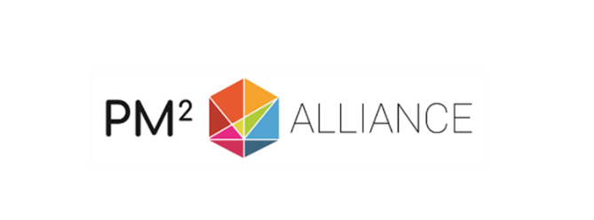

[.text-center]
--
{zwsp} +
{zwsp} +
{zwsp} +
{zwsp} +
Organisation [Name] +
Department [Name]
{zwsp} +
{zwsp} +
{zwsp} +
{zwsp} +
*Deliverables Acceptance Plan* +
[red]#<Project Name>#
{zwsp} +
{zwsp} +
{zwsp} +
{zwsp} +
Date: <Date> +
Doc. Version: <Version>
{zwsp} +
{zwsp} +
{zwsp} +
{zwsp} +

Template version: 3.0.1 +

This artefact template is aligned with the PM² Guide V3.0 +
For the latest version of the templates visit: +
https://www.pm2alliance.eu/publications
{zwsp} +
{zwsp} +
[aqua]#The PM² Alliance is committed to the improvement of the PM² Methodology and of its supporting artefact. Project management best practices and community contributions & corrections are incorporated in the
PM² Alliance’s artefact templates.#
{zwsp} +
{zwsp} +
Join the PM² Alliance and visit the PM² Alliance GitHub to provide your feedback & contribution: +
https://github.com/pm2alliance

--