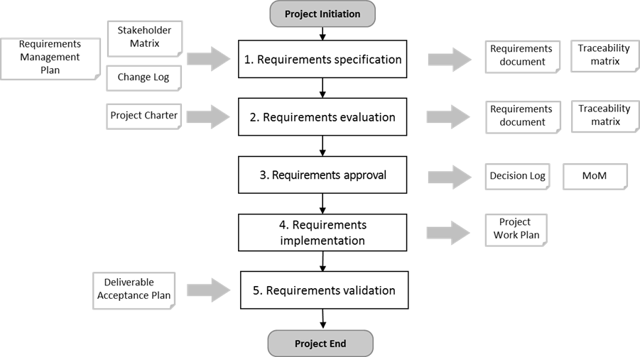

== 3. REQUIREMENTS MANAGEMENT PROCESS
[aqua]#<Please tailor the requirements management process if necessary (complete description or delete activities that are not applicable to the project.>#

The PM2 requirements management process defines the activities related to identifying, documenting, evaluating, prioritising, approving, validating requirements, and communicating the status of requirements to all relevant stakeholders.
[.text-center]
.Requirement Management Process Diagram.

[aqua]#<If you tailor the process, make sure you recreate the above process diagram>#

The requirements management process for this project is a five step process and falls under the responsibilities of the Project Manager (PM) who should execute the process when required throughout the project lifecycle:
[discrete]
==== Step 1: Specify the requirements
Together with the project stakeholders, gather the project requirements and document them clearly in the Requirements documentation. Structure them by adding relevant metadata. Many tools & Techniques can be applied here to gather requirements: brainstorming, nominal group technique, interviews, observation, story boards, prototyping, user stories, and more. Requirements can be documented using MS Word or Excel, or in a requirements documentation and management system.

It is crucial to identify and specify as many of the requirements as possible during planning. Discovering important requirements during execution might have a big impact on project cost and schedule.

In Agile projects the approach to requirements gathering is different from the more traditional (waterfall) project lifecycle. In Agile projects requirements are gradually discovered during the development of the deliverables. In an Agile project it is acceptable that requirements are removed, replaced or re-prioritised during the development.

[discrete]
==== Step 2: Evaluate the requirements
The project team assesses the feasibility, consistency and completeness of the requirements, and estimates the effort/costs needed to implement them. The Project Manager (PM) balances the list of requirements against project constraints (budget, time, etc.) and makes a proposal to the project stakeholders.

A requirement traceability matrix might be helpful to provide structure and traceability in extended requirements documentation, linking high-level business needs to detailed requirement, and detailed requirements to deliverables.

Prioritization of requirements is part of this step. Techniques like e.g. MoSCoW prioritisation can be applied. An important aspect of prioritisation is the relationship between requirements. Related and dependent requirements need to have the same priority.

The Project Manager (PM) verifies if requirements are in-scope as to the scope boundaries defined in the _Project Charter_. Requirements that are out-of-scope are logged as “not in scope” in or outside the Requirements documentation.

Any requirement should be testable on the deliverable(s). For this reason acceptance criteria are defined for each requirement. These criteria are part of the requirements documentation. These criteria are fundamental in the development of the deliverables as well as the test plans for final deliverable acceptance. See also step 5.

[discrete]
==== Step 3: Approve the requirements
The Project Manager (PM) and key stakeholders (such as the Project Owner (PO) or Business Manager (BM)) negotiate and agree on the requirements for the project and their priorities. In these negotiations the Project Manager (PM) makes sure that the in-scope requirements can be delivered given the cost and schedule boundaries set in the Project Charter.

The formal approval of the requirements documentation is logged in the _Decision log_ and/or the minutes of the meeting (MoM), e.g. the Project Steering Committee (PSC).

[discrete]
==== Step 4: Monitor requirements implementation
The Project Manager (PM) continuously monitors the Project Core Team’s (PCT) implementation of the requirements, adds new requirements and changes existing ones where needed through formal change control. New and changed requirements need to follow the steps 1, 2 and 3 as described above. After approval the _Project Work Plan (PWP)_ will be updated.

[discrete]
==== Step 5: Validate the implemented requirements
When the requirements are implemented, the deliverable is validated by the User Representatives (URs). They assess if the initial business need is satisfied. This validation is based on the acceptance criteria that are defined for each requirement (see step 2). Formal acceptance of the project deliverables should comply with the Deliverables Acceptance process as described in the _Deliverable Acceptance Plan_.
